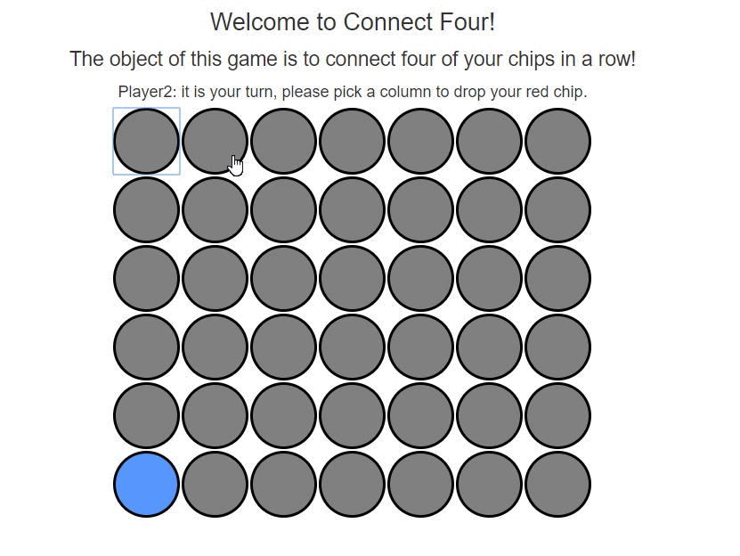

# Connect Four Game 
Connect Four is a classic game that was released in the mid-70’s. So if you remember this one fondly, you might feel your age!

You also won’t need assurance this is a fun game that you will enjoy playing with the kids.

 

### Objective of the game – 
To be the first to connect four of your own discs of the same color next to each other vertically, horizontally, or diagonally.

Number of players – Two.

### How to play

Choose a color and then take turns dropping colored discs from the top into a seven-column, six-row vertically suspended grid.
The pieces fall straight down, occupying the next available space within the column.
Try to create 4 in a row of your own color vertically, horizontally or diagonally. You can block your opponent from getting 4 in a row by putting your own disc in.
Once the winner has "Connect Four", you can pull out the slider bar to release all the discs and start the fun all over again.
Also known as: Captain’s Mistress, Four Up, Plot Four, Find Four, Fourplay, Four in a Row and Four in a Line

### Educational Benefits of Connect 4
As well as the basic benefits of playing games like practice following rules, how to be a ‘good sport’ – winning or losing, the Connect Four game also:

* Builds skills such as problem solving, basic math
* Encourages players to plan ahead – looking out for opportunities to connect 4 discs
* Provides opportunity to detect patterns
* Instigates prediction of the outcome of alternative moves – for your own play as well as your opponent’s. Keeping an eye on their moves keeps you one step ahead!
* Learn from experience – if you can ever get in a position to win by 2 options in one move, then you will never forget it!

